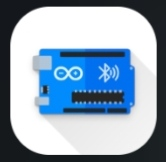

# IoT RC Car — WiFi & Bluetooth Controlled, with Obstacle Sensing

An ESP8266/Arduino-based remote-controlled car with three evolving control implementations: WiFi (via built-in web server), Bluetooth (serial commands), and a sensor-augmented WiFi version with ultrasonic obstacle detection.

## Demo Video

<video src="https://github.com/user-attachments/assets/f8f30786-e63d-4e0b-9e4d-e8f5605d9ebc" width="300" controls></video>

## How it works
The car uses an **L298N motor driver** to control two DC motors independently (differential drive), enabling forward, backward, left, right, and diagonal movement.

- **WiFi versions (ESP8266):** the board creates its own WiFi access point and hosts a lightweight web server. Movement commands are sent as HTTP requests from any browser/phone connected to the car's network — no app installation needed. It's also compatible with dedicated WiFi RC car controller apps, such as  **[ESP8266 WiFi Robot Car](https://play.google.com/store/apps/details?id=com.bluino.esp8266wifirobotcar) by Bluino**, which provides a ready-made directional control interface over the same web server.
- **Bluetooth version:** an Arduino + Bluetooth module receives single-character serial commands (`F`, `B`, `L`, `R`, etc.) typically sent from a Bluetooth RC-car controller app, such as  **[Arduino Bluetooth Controller](https://play.google.com/store/apps/details?id=com.giumig.apps.bluetoothserialmonitor) by Giumig Apps**, with adjustable speed levels and an electronic braking feature.

## Project Versions
| Folder | File | Description |
|---|---|---|
| [`wifi-car/`](./wifi-car) | `wificar_project.ino` | Base version — WiFi AP + web server, LED and buzzer control (horn) alongside driving |
| [`wifi-car-sensor/`](./wifi-car-sensor) | `wificar_sensor_project.ino` | Adds an **HC-SR04 ultrasonic sensor** for real-time obstacle distance sensing |
| [`bluetooth-car/`](./bluetooth-car) | `Bluetooth_Car.ino` | Alternative control scheme over Bluetooth serial instead of WiFi |

Each folder also contains a `HARDWARE_CONNECTIONS.md` with the full wiring/pinout for that specific version, plus a reference photo.

## Hardware Used
- ESP8266 (WiFi versions) / Arduino + Bluetooth module (Bluetooth version)
- L298N Motor Driver
- DC Motors (x2 or x4, differential drive)
- HC-SR04 Ultrasonic Sensor (sensor version only)
- LED + Buzzer (accessory version)

## Tech Stack
- C++ (Arduino framework)
- ESP8266WiFi / ESP8266WebServer libraries

## How to Run
1. Open the relevant `.ino` file (inside its version folder) in the Arduino IDE
2. Install board support for ESP8266 (WiFi versions) via Boards Manager
3. Wire the components as described in that version's `HARDWARE_CONNECTIONS.md`
4. Upload the sketch
5. **WiFi versions:** connect to the car's WiFi network (`WIFI Car Project`) and either open its IP in a browser, or control it through the **ESP8266 WiFi Robot Car** app (Bluino) on your phone
6. **Bluetooth version:** pair via a Bluetooth serial terminal or the **Arduino Bluetooth Controller** app

## Repository Structure
```
IoT-Wifi-RC-Car/
├── README.md
├── .gitignore
├── app-icon.png
├── bluetooth-app-icon.jpeg
│
├── bluetooth-car/
│   ├── Bluetooth_Car.ino
│   ├── Bluetooth_Car_HARDWARE_CONNECTIONS.md
│   └── bluetooth-rc-car-arduino-program.jpg
│
├── wifi-car/
│   ├── wificar_project.ino
│   ├── wificar_project_HARDWARE_CONNECTIONS.md
│   └── wifi-controlled-car.jpg
│
└── wifi-car-sensor/
    ├── wificar_sensor_project.ino
    └── wificar_sensor_project_HARDWARE_CONNECTIONS.md
```
